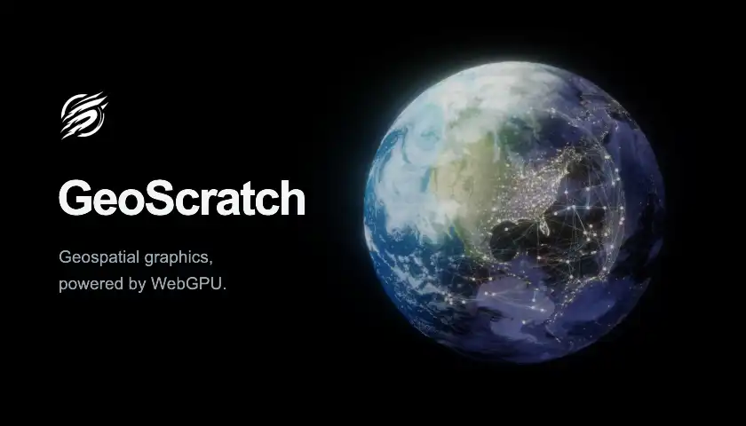

# GeoScratch

[English](./README.md) | [简体中文](./README_zh.md)

[![NPM Package][npm]][npm-url]

GeoScratch is an ES module graphics library for WebGPU-based geovisualization. It exposes lower-level GPU building blocks such as buffers, bindings, pipelines, render passes, compute passes, textures, shaders, and frame orchestration, then layers geospatial helpers and terrain-oriented application modules on top.

The library is designed for developers who want direct control over WebGPU resources while building scenes, maps, globes, terrain layers, or GPU-driven experiments.



## Quick Start

```bash
npm install
npm run backend:setup
npm run dev
```

Open the Vite URL to browse examples. A WebGPU-capable browser is required for rendering examples.

Backend setup requires Python 3.12–3.14 and is needed only once. `npm run dev`
starts both the frontend and shared data backend; switching examples needs no
service restart. Prepare missing datasets separately using the
[backend guide](./examples/backend/README.md). Use `npm run dev:frontend` for
frontend-only examples without installing Python dependencies.

## Commands

| Command | Description |
| --- | --- |
| `npm install` | Install dependencies from `package-lock.json`. |
| `npm run backend:setup` | Install the shared Python environment for example data services. |
| `npm run dev` | Build library and Workers, then start Vite and the shared backend together. |
| `npm run dev:frontend` | Build library and Workers, then start only Vite. |
| `npm run dev:backend` | Start only the shared example data backend. |
| `npm run test:backend` | Run shared backend and dataset Python tests. |
| `npm test` | Build the library package, then run Mocha tests in `tests/`. |
| `npm run build` | Build the library package and standalone example pages into `dist/examples/`. |
| `npm run serve` | Preview built examples with the shared data backend. |
| `npm run docs:generate` | Regenerate committed API facts and references from TypeScript entrypoints. |
| `npm run docs:translations` | Confirm reviewed Chinese translations against current English bodies. |
| `npm run docs:check` | Read-only verification of API facts, coverage, links, and translation freshness. |

## API Documentation

The [API knowledge root](./docs/api/README.md) documents the complete current Scratch
and Geo topology. English pages are canonical and every page has a paired Chinese
translation. Generated references follow the real package exports, while semantic
pages explain ownership, lifecycle, composition, diagnostics, and subsystem boundaries.

Public API changes must update source TSDoc, generated facts, and both language pages.
The root [agent contract](./AGENTS.md) defines the authority and verification rules.

## Project Structure

| Path | Purpose |
| --- | --- |
| `packages/geoscratch/` | Publishable library package. |
| `packages/geoscratch/src/index.ts` | Namespace-only package root exposing `scratch` and `geo`. |
| `packages/geoscratch/src/scratch.ts` | Formal `geoscratch/scratch` facade. |
| `packages/geoscratch/src/scratch/` | TypeScript source-first GPU, Worker, diagnostics, and geometry foundation. |
| `packages/geoscratch/src/geo/` | TypeScript source-first coordinates, tiling, and virtual-raster adaptation. |
| `packages/geoscratch/dist/` | Generated package JavaScript and declaration output. |
| `examples/` | Examples workspace, examples browser, and standalone demo pages. |
| `docs/assets/` | Documentation and project branding assets. |
| `examples/public/` | Large local demo data that must be fetched by stable absolute URL. |
| `tests/` | Node-compatible Mocha tests. |

## Package Entrypoints

The package root exposes only the two architecture namespaces:

```js
import { scratch, geo } from 'geoscratch'
```

Use the formal subpaths for direct imports:

```js
import { GPURuntime, WorkerSystem, sphere } from 'geoscratch/scratch'
import { MercatorCoordinate, WebMercatorQuad } from 'geoscratch/geo'
```

Scratch is the domain-neutral TypeScript source-first capability foundation; Geo
adapts those contracts for geographic semantics. The one-way dependency is summarized
as **Geo from the Scratch**.

## Geo Streaming And Workers

`geoscratch/geo` exposes OGC `WebMercatorQuad`, finite `TileMatrixLimits`,
high-precision canonical coordinates, virtual-raster demand and residency, a pure
cache address/coherence adapter, owned page transfer, and Scratch GPU publication.
Global tile identity is mapped through compact source coverage rather than a dense
world page table.

`WorkerSystem`, imported from `geoscratch/scratch`, is an independent, explicitly
constructed thread abstraction. It accepts URL-loaded custom modules, bounded
priority groups, cooperative and hard cancellation, stale-result rejection,
stateful contexts, Transferable ownership, and structured remote diagnostics. It
shares no mutable state or lifecycle authority with `GPURuntime` and has no Geo,
tile, DEM, or GPU dependency.

Underwater Terrain is the executable Surface Reveal reference: a semi-transparent
WebGPU terrain canvas preserves the MapLibre basemap as geographic context while exposing
the underwater terrain. Terrain demand resolves standard WebMercatorQuad DEM tiles in
Workers, can persist decode-ready raw height pages through Scratch Cache, transfers pages
into a finite atlas, and samples them logically in the vertex shader with cross-page
filtering and parent fallback. The source PNG is only an offline COG build input; the
browser has no full-image or legacy-tile fallback. Raster residency remains capped by
source detail while a separate GPU projected-grid frontier selects perspective-aware
terrain patches and resolves mesh-stitching neighbors through global logical tile identity.

## Scratch Worker Modules

Scratch Worker modules use one contract from TypeScript source through deployment;
they do not require Vite URL imports or a bundler plugin:

```ts
// image-worker-contract.ts
import { defineWorkerModuleContract } from 'geoscratch/scratch'

export const IMAGE_WORKER = defineWorkerModuleContract({
    id: 'example.image-worker',
    version: '1',
})
```

```ts
// image-worker.ts
import { IMAGE_WORKER } from './image-worker-contract.js'

export default IMAGE_WORKER.implement({
    operations: {
        decode(input: ArrayBuffer) {
            return { byteLength: input.byteLength }
        },
    },
})
```

Register entries once in a build config and emit standalone browser ESM artifacts:

```ts
// worker-modules.ts
import { defineWorkerModuleBuild } from 'geoscratch/scratch'
import { IMAGE_WORKER } from './image-worker-contract.js'

export default defineWorkerModuleBuild({
    outDir: './public/scratch-workers',
    modules: [ { contract: IMAGE_WORKER, entry: './image-worker.ts' } ],
})
```

```bash
geoscratch-worker build --config ./worker-modules.ts
```

Serve the generated directory as static files, then resolve contracts explicitly:

```ts
import { WorkerModuleCatalog, WorkerSystem } from 'geoscratch/scratch'
import { IMAGE_WORKER } from './image-worker-contract.js'

const modules = await WorkerModuleCatalog.load(
    new URL('/scratch-workers/manifest.json', location.href)
)
const workers = new WorkerSystem({ maxWorkers: 4, moduleResolver: modules })
const group = workers.createGroup({
    id: 'images',
    modules: [ IMAGE_WORKER ],
    isolation: 'group',
    size: { min: 0, max: 4 },
    maxQueuedTasks: 64,
    maxActiveTasks: 4,
    idleTimeoutMs: 30_000,
})
```

The CLI requires Node.js 18 or newer. It produces content-addressed JavaScript,
source maps, and `manifest.json`; generated files should be deployed together but
need not be committed. Manifest hashes are deployment facts, not a claim that the
runtime performs Subresource Integrity. The manifest also marks the directory as
CLI-owned build output, so the command refuses to replace a non-generated directory.
The application still owns catalog loading, `WorkerSystem`, groups, and disposal.

## Scratch Persistent Cache

`PersistentCache` is independent from Worker, GPU, and Geo. IndexedDB stores
structured metadata and is the authoritative commit point; optional raw
`ArrayBuffer` payloads live in OPFS under immutable `(id, revision)` keys:

```js
import { PersistentCache, persistentCacheKey } from 'geoscratch/scratch'

const cache = await PersistentCache.open({
    namespace: 'my-dataset-v1',
    maxPayloadBytes: 128 * 1024 * 1024,
    maxEntries: 2048,
    lifecycle: { kind: 'durable', open: 'reuse' },
})
const key = persistentCacheKey({ id: 'tiles/10/843/418', revision: 'source-v3' })
await cache.put(key, {
    metadata: { format: 'raw/uint8', width: 256, height: 256 },
    payload: decodedBytes.buffer,
})
const result = await cache.get(key)
await cache.dispose()
```

The cache snapshots caller input and returns a new caller-owned buffer on a hit, so
it can be transferred. It has no hidden memory tier and no Buffer/Texture conversion
API; applications own those policies and conversions. Omitting cache construction is
the explicit no-cache mode. Storage commits and garbage collection remain safe across
contexts; synchronous `inspect()` reports bounded `observationScope: 'instance'`
facts instead of claiming a globally synchronized diagnostic snapshot.
Lifecycle is explicit: durable caches either reuse or clear before open, while a
session cache resets before open and cleans on awaited disposal. Session storage is
still disk-backed; omit cache construction when a visualization should not write
IndexedDB or OPFS.

## Scratch Async Resource Allocation

Persistent Scratch buffer and texture allocation is acknowledged asynchronously. A resource is returned only after its native validation and out-of-memory scopes settle successfully; texture replacement follows the same transaction boundary.

```js
const runtime = await GPURuntime.create()
const vertices = await runtime.createBuffer({
    label: 'vertices',
    size: 4096,
    usage: GPUBufferUsage.VERTEX | GPUBufferUsage.COPY_DST,
})
const color = await runtime.createTexture({
    label: 'color',
    size: { width: 1024, height: 768 },
    format: 'rgba8unorm',
    usage: GPUTextureUsage.RENDER_ATTACHMENT | GPUTextureUsage.TEXTURE_BINDING,
})

await color.resize({ width: 1920, height: 1080 })
const evidence = runtime.diagnostics.exportEvidence()
```

`runtime.diagnostics` exposes current resource facts, bounded operation and incident history, and explicit temporary deep capture. Logical footprint evidence is not physical VRAM.

## Scratch Resource Views And Bindings

Buffers are raw containers. Every buffer range consumer receives an immutable
`BufferRegion`; persistent texture consumers receive an immutable logical
`TextureViewSpec`. Supporting native objects are Promise-only and a BindSet is
returned only after its first preparation is acknowledged:

```js
const uniforms = await runtime.createBuffer({
    size: 256,
    usage: GPUBufferUsage.UNIFORM | GPUBufferUsage.COPY_DST,
})
const uniformRegion = uniforms.region()
const colorView = color.view({ dimension: '2d' })
const sampler = await runtime.createSampler()
const layout = await runtime.createBindLayout({
    group: 0,
    entries: [
        { binding: 0, name: 'uniforms', type: 'uniform', visibility: [ 'vertex' ] },
        { binding: 1, name: 'color', type: 'texture', sampleType: 'float', viewDimension: '2d', visibility: [ 'fragment' ] },
        { binding: 2, name: 'sampler', type: 'sampler', samplerType: 'filtering', visibility: [ 'fragment' ] },
    ],
})
const set = await runtime.createBindSet(layout, {
    uniforms: uniformRegion,
    color: colorView,
    sampler,
})

await color.resize({ width: 1920, height: 1080 })
await set.prepare()
```

Content writes do not require preparation. Allocation replacement makes an
affected BindSet `stale`; submission fails before encoder creation until the
application explicitly awaits `prepare()`. Submission never rebuilds bindings.

## Scratch Submission Outcomes

`SubmissionBuilder.submit()` stays synchronous. Native validation remains
asynchronous and is exposed explicitly:

```js
const runtime = await GPURuntime.create({
    diagnostics: {
        submissionScopes: 'summary',
        maxPendingNativeObservations: 64,
    },
})
const submitted = runtime.createSubmission()
    .compute(pass, [ dispatch ])
    .submit()

const nativeOutcome = await submitted.nativeOutcome
await submitted.done
```

`summary` is the default and uses one constant-size native error-scope bundle
per effectful submission. `off` opens no submission scopes and reports
`unobserved`; queue completion is not relabeled as validation success.
`maxPendingNativeObservations` bounds unsettled submission and direct-readback
observations and fails before native effects when exhausted.

`SubmittedWork.nativeOutcome` always resolves to an immutable serializable
result. `SubmittedWork.done` joins native observation, queue completion, and
runtime/device lifecycle until that completion boundary settles; it rejects
structurally if any applicable boundary fails, but does not wait for readback
mapping or host copy. A delayed failure marks only still-current potential
writes `indeterminate`, never rolls an epoch back, and cannot poison content
already advanced by a later producer.

Per-command/pass attribution is temporary and finite:

```js
const capture = runtime.diagnostics.capture({
    maxOperations: 128,
    maxDurationMs: 5_000,
    maxEvidenceBytes: 256 * 1024,
    nativeSubmissionDetail: 'step',
})
// Reproduce the issue, then stop the bounded capture.
const report = capture.stop()
```

Default summary failures identify the enclosing submission family. Detailed
capture identifies a scoped location, not necessarily one native call; OOM does
not prove that one command or resource alone exhausted physical memory.


## Scratch Readback

Direct readback stays synchronous until bytes are requested. Its first
materialization acknowledges an ephemeral staging allocation before copy or
queue use:

```js
const resultRegion = resultBuffer.region()
const direct = runtime.createReadback({ source: resultRegion })
const directBytes = await direct.toBytes()
```

The same operation accepts a texture subresource. `toBytes()` removes native
row padding, while `map()` exposes padded staging without another host copy:

```js
const pixels = runtime.createReadback({
    source: {
        resource: colorTexture,
        mipLevel: 0,
        size: { width: 64, height: 64 },
        aspect: 'all',
    },
})
const lease = await pixels.map()
try {
    const mapped = new Uint8Array(lease.view)
    const { stagingBytesPerRow } = lease.rowLayout
    // Read mapped rows while the lease is active.
} finally {
    lease.dispose()
}
```

An ordered readback command owns one acknowledged reusable staging slot, so its
factory is Promise-only while `submit()` remains synchronous:

```js
const ordered = await runtime.createReadbackCommand({
    source: {
        region: resultRegion,
        contentEpoch: resultBuffer.contentEpoch,
    },
    whenMissing: 'throw',
})
const submitted = runtime.createSubmission().readback(ordered).submit()
const orderedBytes = await ordered.result({ after: submitted }).toBytes()
await submitted.done
```

`SubmittedWork.done` joins submission native observation, replayed queue-work
completion, and lifecycle until that completion settles; it does not cover
mapping or host copy. Direct readback rejects current `indeterminate` source
content before staging allocation.
Runtime options `maxPendingOperations` and `maxStagingBytes` bound current
readback ownership, including padded texture staging and active mapped leases.
Mapping validation is reported structurally as
`SCRATCH_READBACK_MAPPING_VALIDATION_FAILED`; native message prose is evidence,
not the classifier.

## Minimal Usage

The example below renders a hard-coded triangle onto a canvas.

```js
import { GPURuntime } from 'geoscratch/scratch'

const canvas = document.getElementById('GPUFrame')

main().catch(console.error)

async function main() {
    const runtime = await GPURuntime.create({ label: 'triangle runtime' })
    const surface = runtime.createSurface(canvas, { format: 'preferred' })
    const shaderModule = await runtime.createShaderModule({
        sourceParts: [ { code: `
            @vertex
            fn vsMain(@builtin(vertex_index) index: u32) -> @builtin(position) vec4f {
                let positions = array(
                    vec2f(0.0, 0.58),
                    vec2f(-0.58, -0.48),
                    vec2f(0.58, -0.48)
                );
                return vec4f(positions[index], 0.0, 1.0);
            }

            @fragment
            fn fsMain() -> @location(0) vec4f {
                return vec4f(0.12, 0.72, 0.58, 1.0);
            }
        ` } ],
    })
    const program = runtime.createProgram({
        vertex: { module: shaderModule, entryPoint: 'vsMain' },
        fragment: { module: shaderModule, entryPoint: 'fsMain' },
    })
    const pipeline = await runtime.createRenderPipeline({
        program,
        targets: [ { format: surface.format } ],
    })
    const pass = runtime.createRenderPass({
        color: [ {
            target: surface,
            load: 'clear',
            store: 'store',
            clear: [ 0.03, 0.05, 0.08, 1 ],
        } ],
    })
    const draw = runtime.createDrawCommand({
        pipeline,
        count: { vertexCount: 3 },
        resources: { read: [], write: [] },
        whenMissing: 'throw',
    })

    function render() {
        runtime.createSubmission({ validation: 'throw' })
            .render(pass, [ draw ])
            .submit()
        requestAnimationFrame(render)
    }

    render()
}
```

## Examples

Run `npm run dev` and open the examples browser. Each demo also has a standalone page:

| Example | Path |
| --- | --- |
| Hello Triangle | `examples/helloTriangle/` |
| Uniform Triangle | `examples/uniformTriangle/` |
| Compute Readback | `examples/computeReadback/` |
| Submission Order | `examples/submissionOrder/` |
| External Image Upload | `examples/externalImageUpload/` |
| Texture Resize | `examples/textureResize/` |
| Hello Vertex Buffer | `examples/helloVertexBuffer/` |
| Texture Sampling | `examples/textureSampling/` |
| Render To Texture | `examples/renderToTexture/` |
| Indirect Execution | `examples/indirectExecution/` |
| Readiness Policies | `examples/readinessPolicies/` |
| Underwater Terrain | `examples/underwaterTerrain/` |
| Flow Layer | `examples/flowLayer/` |
| Flow Field | `examples/flowField/` |
| Hello GAW | `examples/helloGAW/` |

## Development Notes

- Keep public exports routed through `packages/geoscratch/src/index.ts` and package exports pointed at `packages/geoscratch/dist/`.
- Add browser/WebGPU demos under `examples/<name>/index.html` and `examples/<name>/main.ts`.
- Examples must import the package as `geoscratch`, not reach into library source by relative path.
- Keep ordinary example images and shaders beside their owning example, using relative asset URLs or raw shader imports.
- Keep library-owned runtime assets beside the source module that owns them, under `packages/geoscratch/src/`.
- Use `examples/public/` only for large local data that must be loaded by stable absolute URLs such as `/json/...`.
- Use `npm test` for Node-compatible checks, and verify rendering changes in a WebGPU-capable browser.

[npm]: https://img.shields.io/npm/v/geoscratch
[npm-url]: https://www.npmjs.com/package/geoscratch
