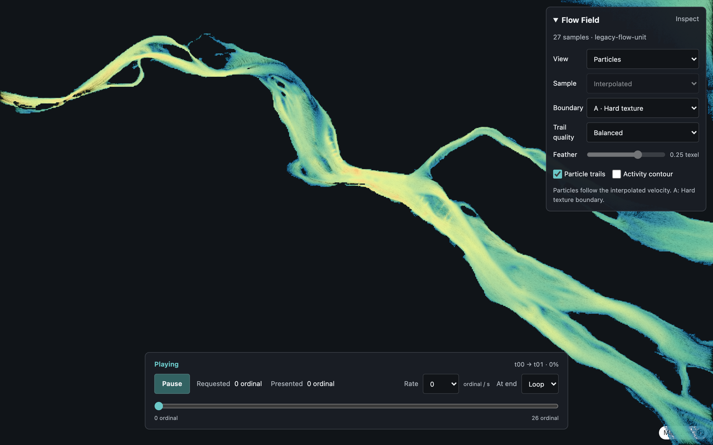
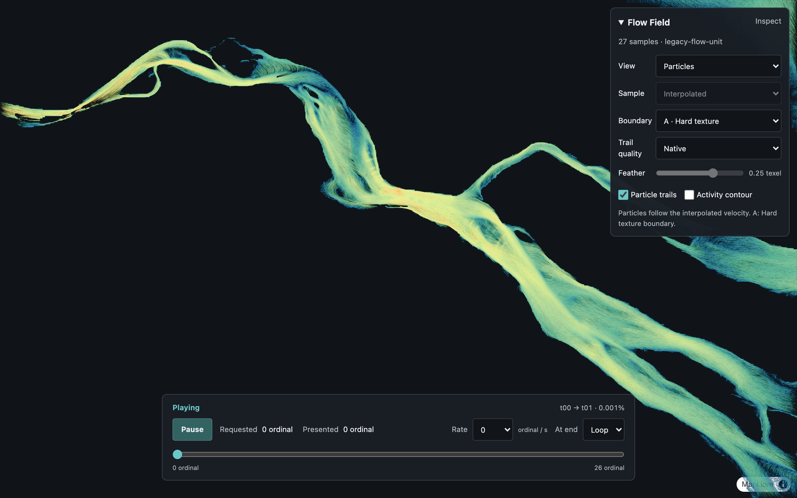

# Flow Field High-Refresh Optimization

Date: 2026-09-11. Baseline source: `8e54683`. Prepared-candidate phase: `e3d7245`.

## Scope And Diagnosis

Flow Field still uses `GpuWebMercatorQuadCover`; the CPU cover migration applies
to Underwater Terrain. Its spatial adapter was unchanged by the shared-backend
PR, and resident static playback retained one spatial build throughout diagnosis.

On the local M1 Max (24 GPU cores) / LG 144 Hz non-main display, a 1760x880
reference viewport with DPR 2 rendered 3520x1760 pixels. The original diagnostic
counter-only window measured 40.57 Flow updates/s; reducing the entire canvas to
DPR 1 measured 70.13. These were separate exploratory windows, not an ABBA estimate
of the final patch's gain. CPU timing separately measured a 3.75 MiB candidate
comparison each frame at mean 2.86 ms. Both window endpoints had zero active
Workers and the same single spatial build.

## Changes

- [ADR-132](../decisions/ADR-132-flow-prepared-spawn-candidates.md): prepare a private
  immutable candidate copy on spatial changes and reuse its observed identity.
  Mutable views retain full validation. Real stationary windows held
  `candidateComparisonCount` at zero.
- [ADR-133](../decisions/ADR-133-flow-trail-pixel-budget.md): default Balanced limits
  history/depth to reference pixels and a 1080p budget. Surface, basemap, controls,
  diagnostic views and source precision remain native. Native is an explicit
  alternative, and particle state is retained across quality changes.

No shader, particle-count, source-data, camera-cover algorithm, or frame-concurrency
change is included. At the measured size, the three history/depth attachments'
logical base-level payload falls from 70.90 MiB to 17.72 MiB. This is not a claim
about total process VRAM or physical driver allocation.

## Native 144 Hz ABBA Measurement

`FLOW_HIGH_REFRESH_NATIVE=1 node tests/browser/flow-field-high-refresh.mjs` owns one
background Chrome on a verified non-main high-refresh display. It verifies actual
viewport and DPR through CDP, then runs Native / Balanced / Balanced / Native in
one page. Each seven-second window follows 120 accepted reference ticks of warmup.
All windows use zoom 9, a nearly fixed t00/t01 pair at alpha .277, default boundary
A, trails enabled, contour disabled, and a proof background without basemap traffic.
No GPU timestamp queries or CPU profiler run during these windows.

| Window | Surface pixels | History pixels | Updates/s | rAF callbacks/s |
| --- | --- | --- | ---: | ---: |
| Native 1 | 3520x1760 | 3520x1760 | 48.99 | 143.98 |
| Balanced 1 | 3520x1760 | 1760x880 | 67.85 | 143.98 |
| Balanced 2 | 3520x1760 | 1760x880 | 68.85 | 143.99 |
| Native 2 | 3520x1760 | 3520x1760 | 49.14 | 143.98 |

The two-window means are 49.06 versus 68.35 updates/s, approximately 39.3% higher
for Balanced on this run. Both choices include the prepared-candidate optimization;
this comparison isolates the quality policy rather than combining separate timing
runs into a claimed total speedup. Worker counts, spatial builds and candidate
comparison counts stayed unchanged across each window. The owned browser never
became foreground, stayed inside the selected display, and closed after verification.

These are application update and rAF counters, not hardware presentation timestamps
or system GPU utilization. Single-frame admission and GPU sampling costs still
limit throughput; the patch does not establish 144 FPS. Thermal state, other desktop
work, screen size, source time and camera can change performance.

## Quality And Correctness

The browser quality proof waits the same accepted visual warmup after each change.
Balanced intentionally has coarser trail lines and may change density; Native
retains finer rasterization. The following are quality comparisons, not pixel
equivalence claims:

| Balanced | Native |
| --- | --- |
|  |  |

Passed gates include:

- 1,799 Mocha tests (two existing opt-in browser gates pending), typecheck,
  documentation generation/translation/check and production build.
- Trail-quality browser proof: bounded allocations from construction, full-size
  Surface, quality changes without particle reset or cover/demand changes, paused
  zero-time resizing, native diagnostic views, A/B/C/D boundaries, new time pairs,
  viewport changes and disposal.
- Native retained-history tests and 833 history-time passes with zero differences
  from the reference byte-decay formulas.
- Real-page 30/60 Hz visual-time checks, including exact paused images and resume.
- DPR 2 stationary, pan, pitch, wheel and wheel-with-time-handoff continuity:
  no frozen rendered frames, particle resets or history clears during gestures,
  and complete cleanup.
- Normal startup, delayed style readiness and warm reload with no page errors.

The first full Mocha run encountered a 2,000 ms timeout in an unchanged temporary
documentation-fixture test. Its isolated retry took 18 ms, and the full unchanged
suite then passed. The camera proof now measures meaningful camera changes against
issued input events, not all rendered frames: CDP round trips can span multiple
frames, and faster rendering must not invalidate that witness. Pitch/zoom extent,
native submissions, simulation continuity, reset and cleanup assertions remain.

Reproduction (prepared Flow data and `npm run dev` required):

```sh
node tests/browser/flow-field-trail-quality.mjs
node tests/browser/flow-field-history-retained.mjs
node tests/browser/flow-field-history-time.mjs
node tests/browser/flow-field-visual-time.mjs
FLOW_CAMERA_CONTINUITY_DPR=2 node tests/browser/flow-field-camera-continuity.mjs
node tests/browser/flow-field-normal-startup.mjs
FLOW_HIGH_REFRESH_NATIVE=1 node tests/browser/flow-field-high-refresh.mjs
```

Run GPU gates sequentially and finish package builds before starting them. Omit
`FLOW_HIGH_REFRESH_NATIVE` for a headless run, which does not claim 144 Hz display
evidence. Local raw reports/screenshots are under the ignored
`output/flow-field-high-refresh-20260911/` directory; the harnesses regenerate their
own artifacts in their documented output directories.
